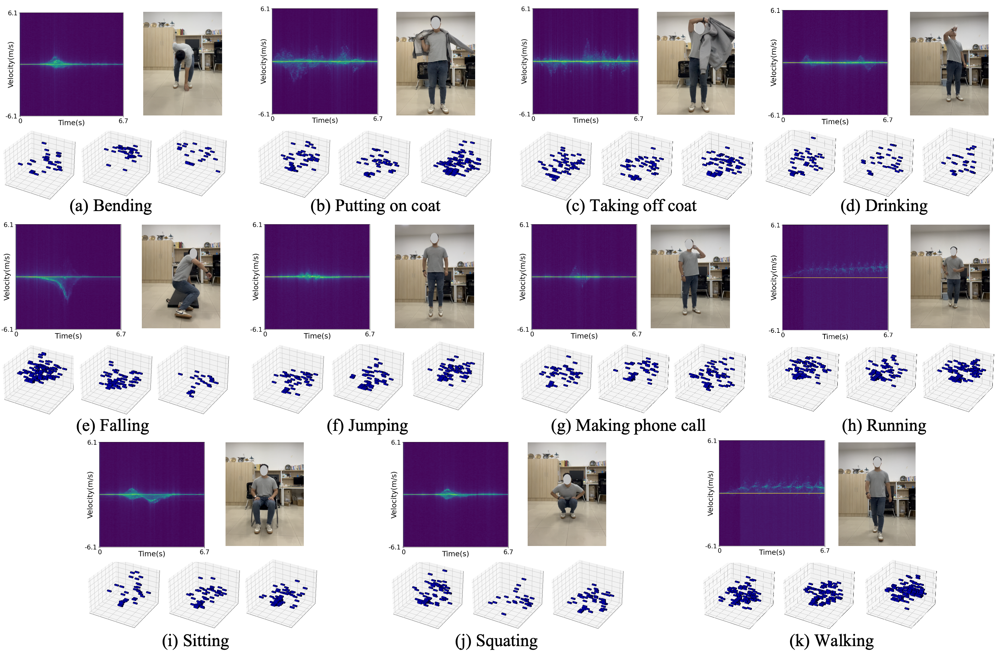
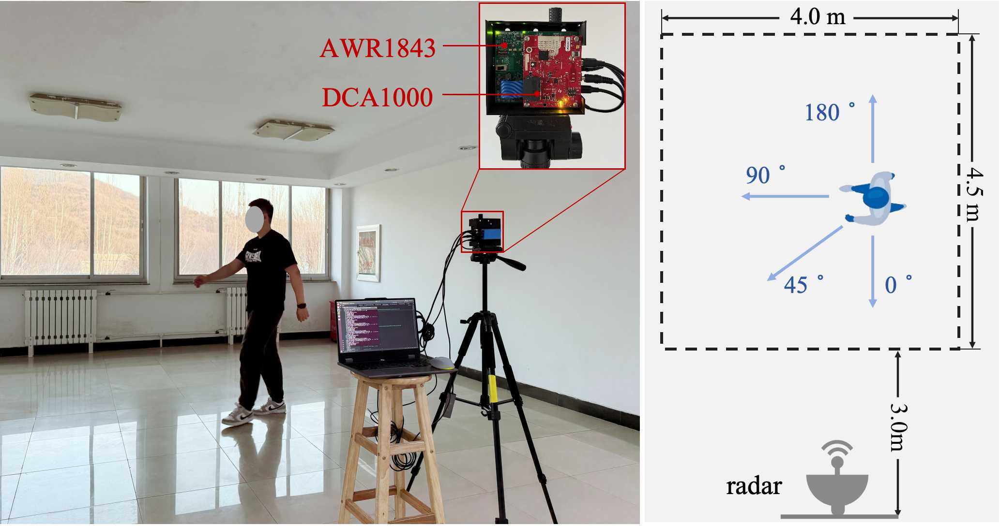

## Multi-Direction HUman Activity (MDHA)

---
A Benchmark and Dual-domain Fusion Method for Direction Insensitive Human Activity Recognition based on MMWave Radar [paper]()

<div style="text-align: center;">
  
</div>

### Activity Categories

---
MDHA includes 11 types of daily Human Activities.

|     Activity      |  Train Set  |  Test Set  |      Activity       |  Train Set  |  Test Set  |
|:-----------------:|:-----------:|:----------:|:-------------------:|:-----------:|:----------:|
|      Bending      |     604     |     68     |  Making phone call  |     252     |     28     |           
|  Putting on coat  |     318     |     36     |       Running       |     237     |     27     |
|  Taking off coat  |     318     |     36     |       Sitting       |     630     |     70     |
|     Drinking      |     185     |     21     |      Squatting      |     539     |     59     |
|      Falling      |     123     |     14     |       Walking       |     244     |     28     |
|      Jumping      |     518     |     58     |        Total        |    3968     |    445     |


### Data Collection

---
MDHA dataset was acquired using a Texas Instruments
AWR1843Boost, paired with a DCA1000 for recording the raw radar data.




We further configured three distinct radar parameter settings to generate data at different resolutions.

|      Parameter      |   Cfg1   |   Cfg2   |   Cfg3   |
|:-------------------:|:--------:|:--------:|:--------:|
|  Center frequency   |  77GHz   |  77GHz   |  77GHz   |
| Sampling frequency  |   7MHz   |   5MHz   |   5MHz   |
|    Chirps number    |    64    |   128    |   250    |
|  Range resolution   |  0.137m  |  0.195m  |  0.39m   |
| Velocity resolution | 0.127m/s | 0.096m/s | 0.049m/s |


### Data Structure
```markdown
dataset/
├── dataset_cfg/  # Configurations to form different datasets  
│   ├── degree_variation/  
│   │   ├── train/
│   │   │   ├── bend.txt
│   │   │   ├── drink.txt
│   │   │   └── ...
│   │   └── test/  
│   └── loso/  
├── time_doppler/  # TDM saved in npy format
│   ├── bend/  
│   │   ├── sample1.npy
│   │   └── ...
│   ├── drink/ 
│   └── ...
├── voxel/   # Voxelized Pcd in npz format
│   ├── bend/  
│   │   ├── sample1.npz
│   │   └── ...
│   ├── drink/ 
│   └── ...
```

### Download
[Baidu Drive](https://pan.baidu.com/...
